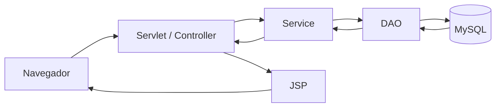

<div align="center">

# Conecta Campus

**Comunicação, participação e informação acadêmica em uma única plataforma.**


</div>

O **Conecta Campus** é uma plataforma web responsiva criada para aproximar estudantes e equipe institucional em um ambiente único, organizado e acessível. O projeto foi desenvolvido por **Kerollayne e Renato** durante uma formação em tecnologia.

## Sumário

- [Visão geral](#visão-geral)
- [Principais funcionalidades](#principais-funcionalidades)
- [Experiência e acessibilidade](#experiência-e-acessibilidade)
- [Arquitetura](#arquitetura)
- [Tecnologias utilizadas](#tecnologias-utilizadas)
- [Segurança e privacidade](#segurança-e-privacidade)
- [Diferenciais do projeto](#diferenciais-do-projeto)
- [Autores](#autores)
- [Licença](#licença)

## Visão geral

O Conecta Campus reúne comunicados, fórum, pesquisas, feedbacks, equipe institucional e informações financeiras em uma interface responsiva. O sistema diferencia as permissões de administradores, integrantes da equipe e alunos, exibindo apenas os recursos permitidos para cada perfil.

Antes da autenticação, uma apresentação contextualiza a ideia do projeto e direciona o visitante para o login ou cadastro. Depois do acesso, a navegação utiliza cabeçalho fixo, menu lateral, indicação da página atual, alertas animados e confirmações visuais.

### Objetivos

- Centralizar conteúdos e serviços acadêmicos essenciais.
- Reduzir a dispersão de comunicados entre canais diferentes.
- Oferecer espaços estruturados de escuta e participação estudantil.
- Aplicar permissões coerentes com a responsabilidade de cada perfil.
- Manter uma experiência consistente em computadores e dispositivos móveis.

### Estado do projeto

| Item | Situação |
| --- | --- |
| Natureza | Projeto acadêmico de formação tecnológica |
| Aplicação | Java Web tradicional, executada em contêiner Servlet |
| Interface | Responsiva para desktop, tablet e celular |
| Persistência | Banco de dados relacional MySQL |
| Autenticação | Sessão HTTP, filtros de acesso e senhas com hash |
| Integrações opcionais | SMTP, Google Forms e fonte CSV publicada |

## Principais funcionalidades

### Acesso e conta

- Onboarding público antes do login e cadastro.
- Cadastro condicionado à leitura e aceitação dos Termos de Uso e da Política de Privacidade.
- Preferência para recebimento de comunicados por e-mail.
- Autenticação com senha protegida por hash usando jBCrypt.
- Recuperação e redefinição de senha por e-mail.
- Ativação e inativação de contas sem apagar o histórico.
- Encerramento seguro da sessão ao sair.

### Perfis e permissões

| Perfil | Principais permissões |
| --- | --- |
| Administrador | Gerenciar usuários, cargos, membros, categorias, comunicados, fórum, pesquisas e feedbacks. |
| Equipe institucional | Criar e editar conteúdos institucionais e consultar os módulos autorizados. |
| Aluno | Ler comunicados, participar do fórum e das enquetes, responder pesquisas, enviar feedback e editar os dados permitidos do próprio perfil. |

Administradores também podem ativar temporariamente o **modo aluno** para conferir a experiência e os conteúdos visíveis aos estudantes, sem alterar o perfil original da conta.

### Perfil do usuário

- Atualização de nome, e-mail, foto e senha.
- Exibição da foto no cabeçalho ou das iniciais quando não houver imagem.
- Curso definido no cadastro e bloqueado para alteração posterior pelo perfil.
- Preferência de notificações por e-mail editável pelo próprio usuário.

### Comunicados

- Criação, edição, categorização e leitura completa de comunicados.
- Imagem opcional e apresentação em formato de notícia.
- Pesquisa textual e filtro por categoria.
- Notificação por e-mail para usuários que escolheram receber novidades.
- Ações administrativas protegidas por permissões e confirmação visual.

### Fórum e enquetes

- Criação de tópicos com respostas, enquete ou os dois recursos combinados.
- Respostas identificadas ou anônimas, conforme a opção disponível.
- Uma participação por usuário em cada enquete.
- Contabilização e apresentação dos resultados no próprio tópico.
- Exclusão administrativa considerando respostas, opções e votos relacionados.

### Pesquisas

- Cadastro de pesquisas acadêmicas e institucionais com título, descrição, prazo e link externo.
- Integração com formulários do Google Forms.
- Controle de status entre aberta e encerrada.
- Registro individual de pesquisa respondida por aluno.

### Feedback

- Envio de sugestões, elogios, reclamações e outros tipos de manifestação.
- Possibilidade de envio anônimo para alunos.
- Consulta restrita aos perfis institucionais autorizados.

### Equipe, membros e cargos

- Gerenciamento de cargos e membros vinculados à instituição.
- Vitrine pública da equipe organizada por cargo.
- Dados de contato apresentados de maneira padronizada.
- Validação e máscara para telefone.

### Relatório financeiro

- Leitura de entradas e saídas a partir de uma fonte CSV publicada.
- Filtro mensal, resumo dos valores, gráfico comparativo e tabela detalhada.
- Endereço da fonte configurado externamente, sem dados financeiros fixos no código.

## Experiência e acessibilidade

- Layout adaptado para computadores, tablets e celulares.
- Menu lateral recolhível com destaque da página atual.
- Feedback visual para sucesso, erro, edição, exclusão e confirmação.
- Modais, alertas e transições com suporte à preferência de redução de movimento.
- Navegação por teclado, foco visível e link para pular diretamente ao conteúdo.
- Campos de formulário com rótulos, instruções e validações claras.

## Arquitetura

O projeto segue uma divisão em camadas para manter responsabilidades separadas:

```text
src/main/
├── java/br/com/conectacampus/
│   ├── controller/  # Servlets e tratamento das requisições
│   ├── service/     # Regras de negócio
│   ├── dao/         # Acesso e persistência no banco de dados
│   ├── model/       # Entidades da aplicação
│   ├── filter/      # Autenticação e controle da visão por perfil
│   └── util/        # Funções auxiliares e autorização
└── webapp/
    ├── WEB-INF/includes/  # Cabeçalho, menu, rodapé e componentes compartilhados
    ├── css/               # Estilos globais, responsivos e específicos
    ├── pages/             # Páginas JSP
    └── index.jsp          # Apresentação inicial
```

O CSS global é carregado por `style.css` e dividido por responsabilidade: base visual, layout, componentes, includes, preferências, animações e responsividade. Estilos realmente exclusivos permanecem associados às respectivas páginas.

### Fluxo de uma requisição



- **Filtros** verificam sessão e contexto de visualização antes da execução das rotas protegidas.
- **Controllers** recebem a requisição, validam os parâmetros e coordenam o fluxo.
- **Services** concentram regras de negócio e decisões da aplicação.
- **DAOs** executam as operações de persistência.
- **JSPs** apresentam ao usuário os dados preparados pelo controller.

## Tecnologias utilizadas

- Java 21
- Jakarta Servlet 6.1 e JSP
- Apache Tomcat 11
- MySQL e MySQL Connector/J
- HTML5, CSS3 e JavaScript
- Bootstrap 5 e Bootstrap Icons
- Chart.js
- jBCrypt

## Segurança e privacidade

- Senhas são armazenadas usando hash, não em texto simples.
- Rotas autenticadas passam por filtro de sessão.
- Ações sensíveis validam o perfil e as permissões do usuário.
- A aceitação dos termos é obrigatória durante o cadastro.
- O recebimento de comunicados por e-mail depende da preferência registrada pelo usuário.
- Dados pessoais devem ser tratados conforme os Termos de Uso, a Política de Privacidade e os princípios aplicáveis da LGPD.

## Diferenciais do projeto

- Reúne comunicação institucional e participação estudantil no mesmo ambiente.
- Aplica permissões diferentes sem fragmentar a experiência entre vários sistemas.
- Permite ao administrador conferir a plataforma pela perspectiva de um aluno.
- Combina canais informativos, pesquisas, fórum e feedback para apoiar a comunidade acadêmica.
- Mantém identidade visual consistente em módulos com objetivos distintos.
- Considera acessibilidade, responsividade, privacidade e clareza das interações desde o cadastro.
- Foi estruturado em camadas, facilitando manutenção e evolução das funcionalidades.

## Autores

- Kerollayne
- Renato

Projeto acadêmico desenvolvido durante uma formação em tecnologia.

## Licença

Este repositório não contém, no momento, um arquivo de licença de software. Antes de copiar, redistribuir ou utilizar o projeto para fins comerciais, solicite autorização aos autores e defina formalmente os termos de uso.
